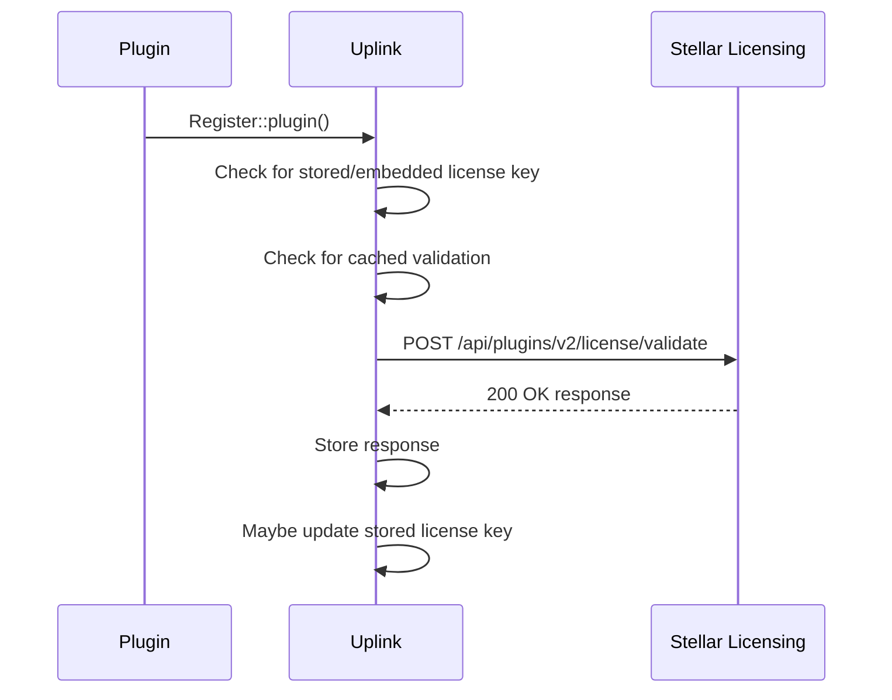

# Uplink features

The goals of this library are to provide a simple way to register one or more plugins / services for licensing and updates. It should provide:

* An API and documentation for registering plugins/services
* Support for plugins that embed license keys within the code
* A user interface for entering / changing license keys
* Support for fetching and installing plugin updates from Stellar Licensing

## Expectations

1. This library will exist within multiple plugins--ideally included via Compuser using Strauss to avoid collisions with other installed versions of the same library.
2. This library may be included in a plugin collection that has a shared codebase, so multiple plugins need to be able to register themselves using a shared library. An example of this usecase would be The Events Calendar and Event Tickets, which have a shared library that all of The Events Calendar add-ons utilize.
3. This library should be as unopinionated as possible when it comes to the UI. It should provide page content that plugins can render where they see fit.

## Features

### Registration

Registration of plugins and services should happen programmatically and the intended API is documented in this repository's [README](/README.md).

### License keys & validation

The Uplink library should communicate with the Stellar Licensing system at specific moments. Those moments are:

1. When a user interacts with a page in the dashboard where Uplink's license key field UI is rendered.
2. When an authorized user* navigates to the plugins page and there has not been a request to the Stellar Licensing system within the past 12 hours.
3. When an authorized user* attempts to upgrade plugins.

_* An authorized user is defined as a user with the `install_plugins` capability._

When a page is loaded where the Uplink library should call home to the Stellar Licensing system, this flow should be followed:

#### Embedded keys

The Stellar Licensing service has the capability of embedding license keys within the plugin code for products that have that capability enabled. The embedding happens at the moment of download. For plugins that expect an embedded license key to exist, the Uplink library needs to be notified of that license key's existence during registration of the plugin. You can see the expected structure in the [README](/README.md#embedding-a-license-in-your-plugin).

You can see an example of this in the wild within the [Events Calendar Pro plugin](https://github.com/the-events-calendar/events-pro/blob/master/src/Tribe/PUE/Helper.php).

#### UI for entering keys

Uplink should provide a UI for entering license keys. Ideally, Uplink should have a way to render license key fields, notifications, enqueue relevent styles & JS, etc within an administrative page as dictated by the plugin. For example, The Events Calendar needs to be able to choose to have the license keys fields/notices for Events Calendar Pro, Filter Bar, Virtual Events, etc (which are all add-ons of TEC) rendered on the _Events > Settings > Licenses_ page in the dashboard. Whereas Restrict Content Pro should be able to have _its_ license key fields rendered on a different Dashboard page.

When a license field is rendered, manipulated, or saved, a validation request should be triggered (see the diagram above).

##### Site & Network-level

When a plugin that includes the Uplink library is activated at the network level, License keys should be able to be entered at both the network and the site level.

### Product updates

The Uplink library should mark a registered plugin as needing an update when a validation response comes back from the Stellar Licensing system with a version number greater than the version number that is currently installed. You can see a reference implementation in [`tribe-common`](https://github.com/the-events-calendar/tribe-common/blob/master/src/Tribe/PUE/Checker.php#L1537).

#### Plugin page

On the _Plugins_ page in the WP Dashboard, any plugin that has an update available should display the update similar to how WordPress core does it. If a user click on `Update`, the zip files should be fetched from the Stellar Licensing system and installed if their license key is valid.
