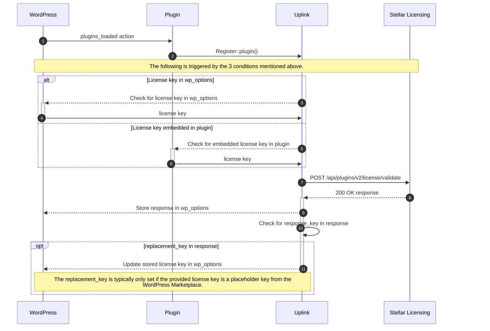

# Uplink features

The goals of this library are to provide a simple way to register one or more plugins / services for licensing and updates. It should provide:

* An API and documentation for registering plugins/services
* Support for plugins that embed license keys within the code
* A user interface for entering / changing license keys
* Support for fetching and installing plugin updates from Stellar Licensing

## Expectations

1. This library will exist within multiple plugins--ideally included via Compuser using Strauss to avoid collisions with other installed versions of the same library.
2. This library may be included in a plugin collection that has a shared codebase, so multiple plugins need to be able to register themselves using a shared library. An example of this usecase would be The Events Calendar and Event Tickets, which have a shared library that all of The Events Calendar add-ons utilize.
3. This library should be as unopinionated as possible when it comes to the UI. It should provide page content that plugins can render where they see fit.

## Features

### Registration

Registration of plugins and services should happen programmatically and the intended API is documented in this repository's [README](/README.md).

### License keys & validation

The Uplink library should communicate with the Stellar Licensing system at specific moments. Those moments are:

1. When a user interacts with a page in the dashboard where Uplink's license key field UI is rendered.
2. When an authorized user* navigates to the plugins page and there has not been a request to the Stellar Licensing system within the past 12 hours.
3. When an authorized user* attempts to upgrade plugins.

_* An authorized user is defined as a user with the `install_plugins` capability._

When a page is loaded where the Uplink library should call home to the Stellar Licensing system, this flow should be followed:




#### Embedded keys

The Stellar Licensing service has the capability of embedding license keys within the plugin code for products that have that capability enabled. The embedding happens at the moment of download. For plugins that expect an embedded license key to exist, the Uplink library needs to be notified of that license key's existence during registration of the plugin. You can see the expected structure in the [README](/README.md#embedding-a-license-in-your-plugin).

You can see an example of this in the wild within the [Events Calendar Pro plugin](https://github.com/the-events-calendar/events-pro/blob/master/src/Tribe/PUE/Helper.php).


#### UI for entering keys

Uplink should provide a UI for entering license keys. Ideally, Uplink should have a way to render license key fields, notifications, enqueue relevent styles & JS, etc within an administrative page as dictated by the plugin. For example, The Events Calendar needs to be able to choose to have the license keys fields/notices for Events Calendar Pro, Filter Bar, Virtual Events, etc (which are all add-ons of TEC) rendered on the _Events > Settings > Licenses_ page in the dashboard. Whereas Restrict Content Pro should be able to have _its_ license key fields rendered on a different Dashboard page.

When a license field is rendered, manipulated, or saved, a validation request should be triggered (see the diagram above).


### Product updates

The Uplink library should mark a registered plugin as needing an update when a validation response comes back from the Stellar Licensing system with a version number greater than the version number that is currently installed. You can see a reference implementation in [`tribe-common`](https://github.com/the-events-calendar/tribe-common/blob/master/src/Tribe/PUE/Checker.php#L1537).

#### Plugin page

On the _Plugins_ page in the WP Dashboard, any plugin that has an update available should display the update similar to how WordPress core does it. If a user click on `Update`, the zip files should be fetched from the Stellar Licensing system and installed if their license key is valid.

### Multisite Licenses

TODO: Notes about stored license file?

Out of the box, Uplink treats all sub-sites as their _own independent site_, storing license keys and authorization tokens
in the options table of that sub-site.

If your product supports multisite level licenses, you can configure Uplink to allow one license key/auth token for the entire
multisite network across multiple situations.

> 💡 To operate at the network level, your plugin **must be network activated** and the proper configuration options enabled.

| Install Type               | Network Activated? | Clause | Uplink Config Option (default is false)             | License & Token Storage Location |
|----------------------------|--------------------|--------|-----------------------------------------------------|----------------------------------|
| Standard                   | –                  | –      | –                                                   | Site level                       |
| Multisite (subfolders)     | Yes                | AND    | `Config::set_network_subfolder_license(true)`       | Network level                    |
| Multisite (subfolders)     | No                 | OR     | `Config::set_network_subfolder_license(false)`      | Site Level                       |
| Multisite (subdomains)     | Yes                | AND    | `Config::set_network_subdomain_license(true)`       | Network level                    |
| Multisite (subdomains)     | No                 | OR     | `Config::set_network_subdomain_license(false)`      | Site Level                       |
| Multisite (domain mapping) | Yes                | AND    | `Config::set_network_domain_mapping_license(true)`  | Network level                    |
| Multisite (domain mapping) | No                 | OR     | `Config::set_network_domain_mapping_license(false)` | Site Level                       |


#### Examples

After [library initialization](../README.md#initialize-the-library), the above config options can be set, e.g.

```php
use StellarWP\Uplink\Uplink;

// ...other config above

// Allow a single network license for multisite subfolders.
Config::set_network_subfolder_license( true );

// Allow a single network license for multisite using subdomains.
Config::set_network_subdomain_license( true );

// Allow a single network license for custom domains/mapped domains.
Config::set_network_domain_mapping_license( true );

Uplink::init();
```

> 🚨 Consider moving your plugin UI and the Uplink License Field settings to the WordPress network UI to prevent
> sub-sites being able to control licensing and token authorization for the entire multisite network if you enable
> any of the multisite config options.

Each config option can also be filtered at runtime, assuming your plugin's slug is registered as `my-plugin-slug`:

```php
add_action( 'init', static function(): void {
	// Replace with a call to your own plugin's config/option to check whether it should be managed in the network.
	$network_enabled = true;

	add_filter( 'stellarwp/uplink/my-plugin-slug/allows_network_subfolder_license',
		static function () use ( $network_enabled ): bool {
			return $network_enabled;
		}, 10 );

	add_filter( 'stellarwp/uplink/my-plugin-slug/allows_network_subdomain_license',
		static function () use ( $network_enabled ): bool {
			return $network_enabled;
		}, 10 );

	add_filter( 'stellarwp/uplink/my-plugin-slug/allows_network_domain_mapping_license',
		static function () use ( $network_enabled ): bool {
			return $network_enabled;
		}, 10 );
} );
```

#### Functions

Uplink provides some handy functions that include automated support for fetching or storing data from
the correct location.

```php
// Checks if the current WordPress user is authorized to make license/token changes (is_super_admin() out of the box).
\StellarWP\Uplink\is_user_authorized();

// Get a stored license key, will fetch from the current site's options or network, depending on your config.
\StellarWP\Uplink\get_license_key( 'my-plugin-slug' );

// Store a license key, will store in the current site's options or network, depending on your config.
\StellarWP\Uplink\set_license_key( 'my-plugin-slug', 'new_license_key' );

// Get the domain associated with a license.
// Note that if any of the multisite options are enabled, the root multisite domain contains a unique suffix
// so that it doesn't override the license key/token for the entire multisite network if it's converted back
// to single site.
// Depending on your configuration, this may the multisite domain with suffix, e.g. example.com/2626gsg
// or, it could be the sub-site domain with path, e.g. example.com/sub1, example.com/sub2 etc...
\StellarWP\Uplink\get_license_domain();

// This will get the license domain without any added suffixes.
\StellarWP\Uplink\get_original_domain();

// Gets the local URL to disconnect a token (delete it locally).
\StellarWP\Uplink\get_disconnect_url( 'my-plugin-slug' );

// Checks if the current site (e.g. the sub-site on multisite) would support multisite licensing.
\StellarWP\Uplink\allows_multisite_license( 'my-plugin-slug' );
```
